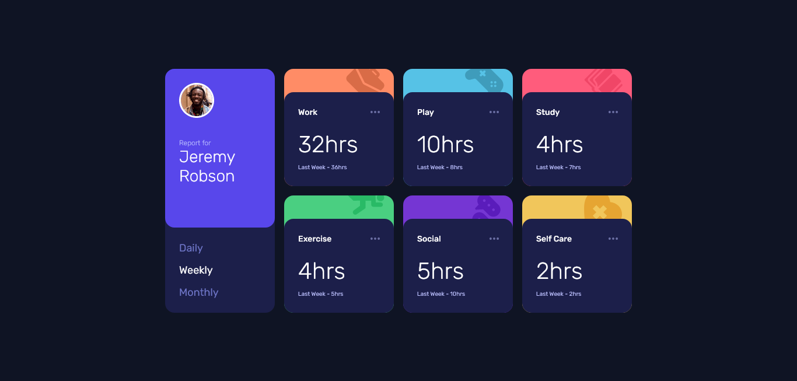

# Frontend Mentor - Time tracking dashboard solution

This is a solution to the [Time tracking dashboard challenge on Frontend Mentor](https://www.frontendmentor.io/challenges/time-tracking-dashboard-UIQ7167Jw). Frontend Mentor challenges help you improve your coding skills by building realistic projects. 

## The challenge

Users should be able to:

- View the optimal layout for the site depending on their device's screen size
- See hover states for all interactive elements on the page
- Switch between viewing Daily, Weekly, and Monthly stats

## Screenshot

## Built with

- Semantic HTML5 markup
- CSS BEM
- CSS Grid
- Mobile-first workflow

## Useful resources

- [CSS BEM - dpw](https://www.youtube.com/watch?v=rltjnLyjFZk&t=818s) - this helped me build a cleaner and more standardized CSS.
- [featch api - Matheus Battisti](https://www.youtube.com/watch?v=qIGYM4S8x50&t=940s) - this helped me understand how _then_ and api consumption work.

## Author

- Website - [my portfolio](https://mikayas.github.io/portfolio/)
- Frontend Mentor - [@mikayas](https://www.frontendmentor.io/profile/mikayas)